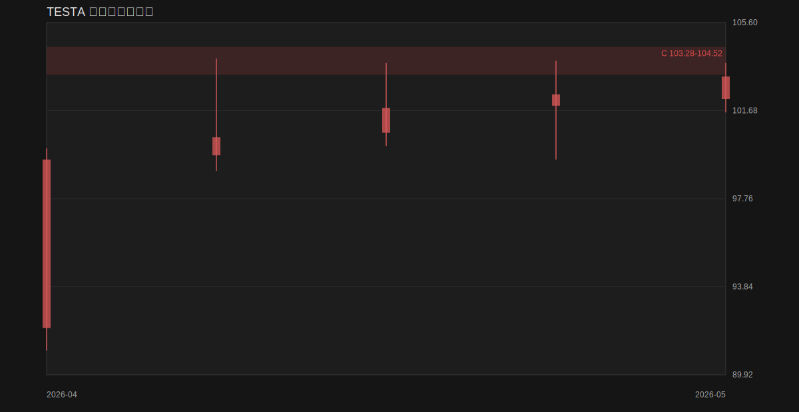

# TESTA 开仓检查记录

<!-- ENTRY_MONITOR_LATEST_ZONES_START -->

<!-- ENTRY_MONITOR_LATEST_ZONES_END -->

| 检测时间 | 股票代码 | 是否允许开仓 | 开仓模型 | 开仓分数 | 计划挂单价 | 止损价 | 第一止盈位 | 盈亏比 | 原因/阻断原因 | 下一步建议 |
| --- | --- | --- | --- | ---: | ---: | ---: | ---: | ---: | --- | --- |
| 2026-06-09 15:10:51 | TESTA | 不允许 | none | 0 | - | - | - | - | 未识别出符合规则的回踩、订单块承接或真突破开仓模型；当前不满足明确开仓模型；[TESTA] 不在 watchlist 中，已自动加入。 | 继续观察，等待回踩承接或真突破结构形成 |

