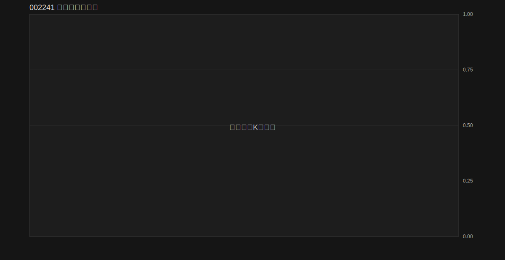

# 002241 开仓检查记录

<!-- ENTRY_MONITOR_LATEST_ZONES_START -->

<!-- ENTRY_MONITOR_LATEST_ZONES_END -->

| 检测时间 | 股票代码 | 是否允许开仓 | 开仓路线/模型 | 开仓分数 | 计划挂单价 | 止损价 | 第一止盈位 | 盈亏比 | 原因/阻断原因 | 下一步建议 |
| --- | --- | --- | --- | ---: | ---: | ---: | ---: | ---: | --- | --- |
| 2026-06-25 16:09:24 | 歌尔股份 | 不允许 | 禁止回补 / none | 0 | - | - | - | - | [002241] 当前使用的是静态数据源 static，但样例数据文件 C:\Users\admin\Documents\New project\sell-monitor\examples\market_data.json 中不存在该股票。 请检查 SELL_MONITOR_PROVIDER 是否被错误设置，或切换回 akshare/baostock。 | 继续观察 |

